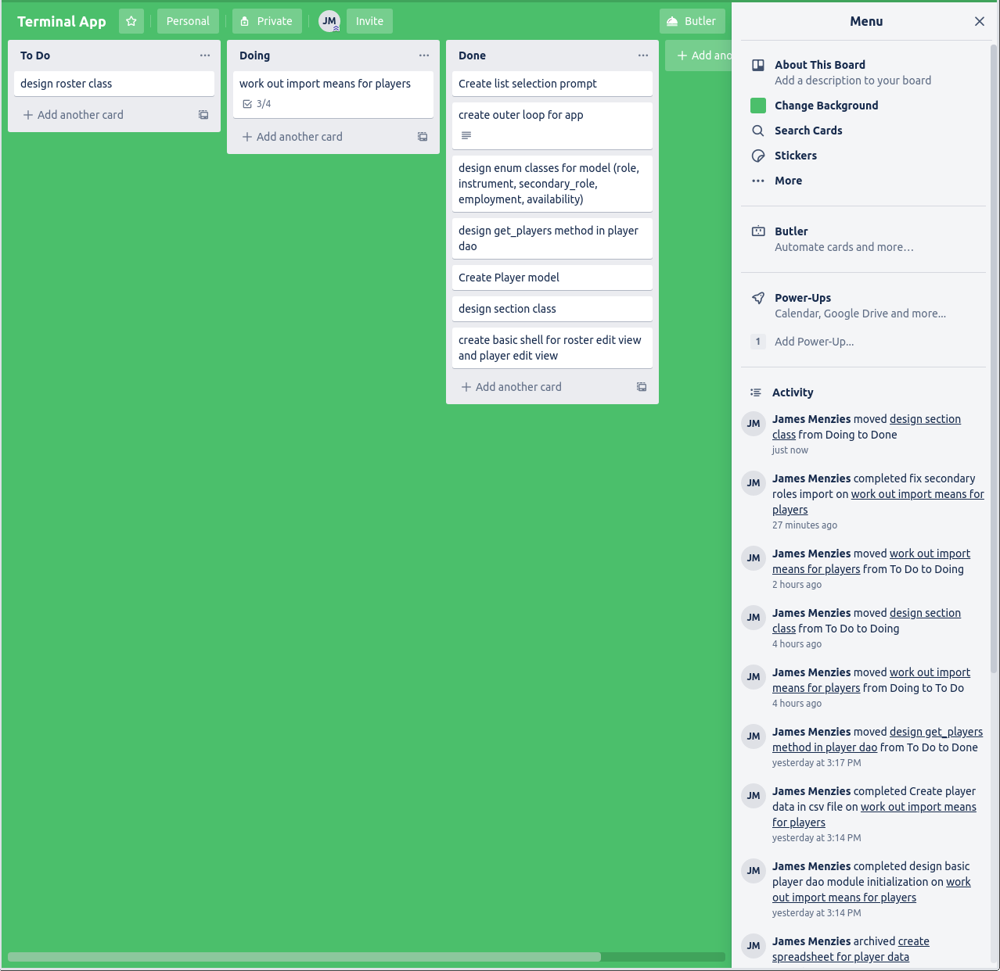

# String Section Rostering Utility
## Software Development Plan

> __NB__ If running this program from the terminal, it is essential that it is run from the src folder as the working directory. To run the program, execute the main.py file.

### Purpose

The utility of this application is two-fold. It is designed to:

1. Maintain a pseudo-database of musicians, including what instrument they play, and the specific roles that they perform. The program allows for basic CRUD operations to be performed on these musicians.

2. Design rosters for specific concert programs, allowing both for manual and automatic filling of positions, whilst ensuring that players aren't put into inappropriate positions. A roster will be able to be printed as well.

### String Rostering 101

For those not familiar with how classical string sections work, here is a quick rundown. There are four string instruments requiring rostering in an orchestra; violins, violas, cellos, and double basses. For each of these instruments, there will be one physical part in the music to play, meaning that all players of the same instrument will play the same music. The exception to this is the violin, for which there are two parts. These sections are known as the first and second violins respectively.

Therefore there are five sections in a string section:
* First violins
* Second violins
* Violas
* Cellos
* Double Bass

There are also rules governed by the positions within each section that a musician will occupy. There are two categories of players; principal and tutti musicians. Principals will always sit in the first chair of their respective sections, whereas tutti players will sit anywhere else.

Violin roles are a little different:
* 1st Violin, 1st chair is known as the __Concert Master__
* 1st Violin, 2nd chair is known as the __Associate Concert Master__
* 1st Violin, 3rd chair is the __Principal__
* 2nd Violin, 1st chair is the __Principal 2nd Violin__

There are two types of employment in the profession as well; regular and casual musicians. Regular musicians are kept on salary whilst casual musicians are brought in for specific programs. It's important to ensure when rostering that you are making full use of your regular musicians before spending money on casual musicians.

### The Rules of the Game

Sometimes how these rules are governed can differ slightly from orchestra to orchestra, so the following ruleset has been adopted for maximum compatibility:

* A musician should always sit in their designated position.
* However, a secondary position can also be assigned to that player.
* Ultimately, the program will allow any musician to sit in any chair provided that they play the appropriate instrument. 
* A musician can only be associated with a single string instrument.

### Who is this Program for?

This app is appropriate for both orchestral administrators and string principals who need to roster musicians in a way that stays consistent with all of the rules above, whilst reducing the manual nature of the task. It is widely considered to be a task that is beneath most people, therefore automating much of the process will help ensure that string rosters are delivered in a timely and efficient manner.

## Key Features

### Data Persistence

Given that an orchestra could have well over 100 string musicians in their employ, it is essential to be able to store that data in between sessions. To do this the program makes use of a CSV file, and it will update it on every creation, edit, and deletion of a player. In order to ensure data integrity, the DAO (Data Access Object) module will also validate its data upon every program start. If it detects a corrupt entry, it will automatically remove it. 

### Autofill and Player Recommendations 

When a player is working on a roster and deciding on which player to fill a chair, the program provides the user with a list of player recommendations, where the most suitable candidates are put on the top of the list. The suitability rankings are as follows from most to least suitable:

| Key | Meaning| Role | Employment |
|---  | ------|------|---------|
| Reg. | Regular | Primary | Permanent |
| Sec. | Secondary | Secondary | Permanent |
| Cas. | Casual | Primary | Casual |
| L.R. | Less Recommended | Non Prim./Sec. | Permanent; or|
|      |                  | Secondary | Casual |
| N.R  | Not Recommended  | Non Prim./Sec. | Casual |

Whilst the user can make use of this feature on its own, it goes hand-in-hand with the autofill feature. If a player wishes to fill a position but has no strong feeling on who should fill it, the autofill function will try to find a candidate of "reg" suitability and select one at random. If it is unable to find one, it will then find a "sec" candidate at random, at which point it will leave the chair unfilled if unsuccessful. The user can autofill a single chair or even the entire string section in one action.

### Demo Mode

If the user merely wishes to try the functionality of the program, without going through the process of building up the player database, the __DEMO__ mode can be used. To access it, append the (--demo) flag when running the application. It contains approximately 100 preconfigured musicians, allowing for all the features of the program to be tested. Please note though that any CRUD operations performed on the players themselves will not be persisted between sessions. 

## User Experience

> NB: This information is also available to the user by prepending the --help argument when executing the application. Also, note that it is required to have Python version 3x installed for the program to run.

### General Navigation

Most of the application is traversed through list selection which done consistently through entering numbers into the terminal. The input is always tested and handled for validity to ensure the program will continue properly regardless of the actual input. In fact, the only actual typing required by the user is when typing a name when editing a player.

There are 2 main parts to the application; where the user can manage the player database and roster creation. Both of these are accessed from the main menu.

### Player Management

There are four operations that can be performed here if the user wishes to cancel any action mid-operation, all they need do is press ENTER whilst leaving the input blank.

* __View:__ Upon selecting this option the user will be presented with the names of all the stored players with their instrument. Upon selecting a player, more detailed info about that person will be displayed.

* __Add:__ This will take the user through the player creation flow, and upon completion, the new player will be added to the player bank. This flow can be canceled safely at any point.

* __Delete:__ This will remove the player. The user will be asked to confirm the action.

* __Edit:__ The user will be taken through the same creation flow as when adding a player, except the user will be informed of any previous attributes.

### Roster Editing

The user will be taken through an initial creation flow where the name and size of each section will be set. From there there are 6 available operations:

* __Autofill all__: Each chair will attempt to be filled via the autofill function as above.

* __Autofill chair__: As above but with a single chair.

* __Remove Player__: Will remove a seated player. The user has the option to designate the player as unavailable making them ineligible for future selection.

* __Fill/Replace Player__: Upon selecting a chair the user will be given a list of recommendations of candidates. This will remove a player is one is already present in the chair.

* __Swap Players__: This will allow two players of the same section to be swapped by typing in two ordinal numbers. A warning will be displayed if the swap involves players performing outside of their usual role.

* __Print__: This will export the roster in its current state to the Rosters folder. The roster will be stored in plain text.

## Control Flow Diagrams

### The Choice Loop
The main program loop is used to allow the user to perform repeated actions whilst remaining in the correct part of the program. Both the player and roster edit sections employ this loop, as well as the main menu.

### List Selection Logic
This is the logic implemented every time the program requires the user to select between one or more concrete options.

### Model UML Diagram

This shows the relationship between the model components of the program. If I were to change the presentation layer (say to a GUI), this component of the program would remain unchanged.

## Implementation Plan

Here is a high level overview of the timeline for feature development. 

|Feature/Component| Due Date | Completed |
|-----------------|--------- | --------- |
|Main Loop of program, basic list selection | 12/7 | Yes|
|Player, class implemented| 13/7 | Yes | 
|Basic player import functionality | 14/7 | Yes|
| Section and Roster classes implemented | 15/7| Yes |
| Player recommendation and autofill functionality | 15/7| Yes |
| Fully implemented list selection with multi-options, multi-columns et al | 16/7 | Yes |
| Roster Edit Controller and Views | 16/7 | Yes |
| Player Edit Controller and Views | 17/7 | Yes |
| Major Testing / Bug Removal | 17/7 | Yes |
| Print function | 17/7 | Yes |
| Documentation compilation | 18/7 | Not yet|
| Final clean up | 19/7 | Not yet |

## Project Management Screenshots

For this project I relied on the Trello platform to visualize my tasks. Here are a number of snapshots of my progress on the project over the week-long development cycle.

